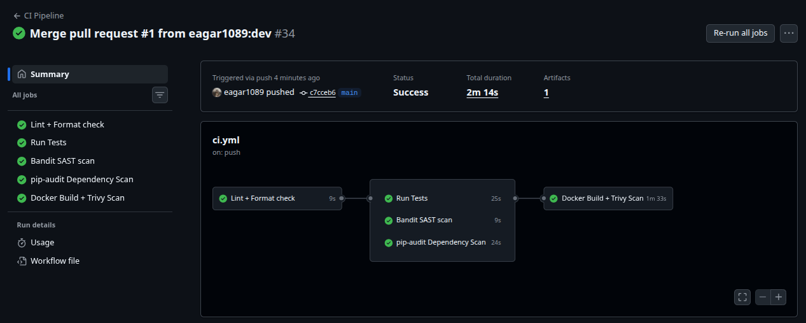
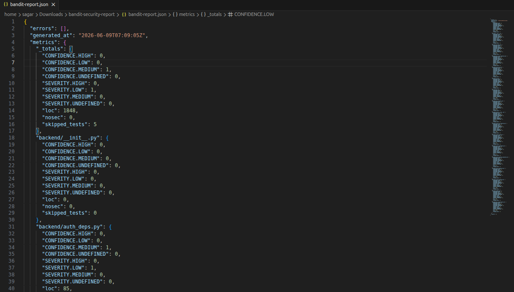
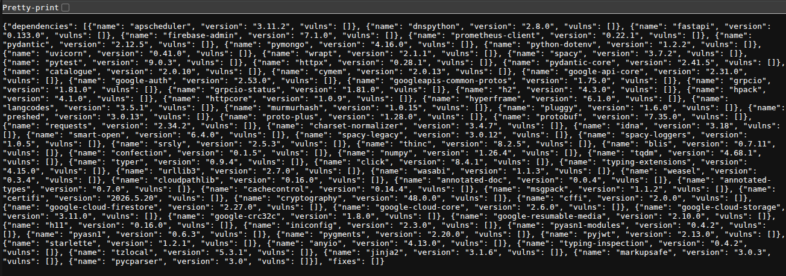
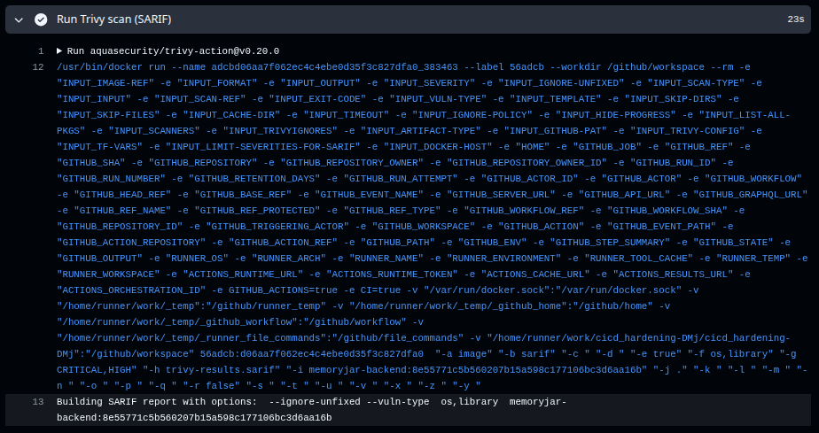
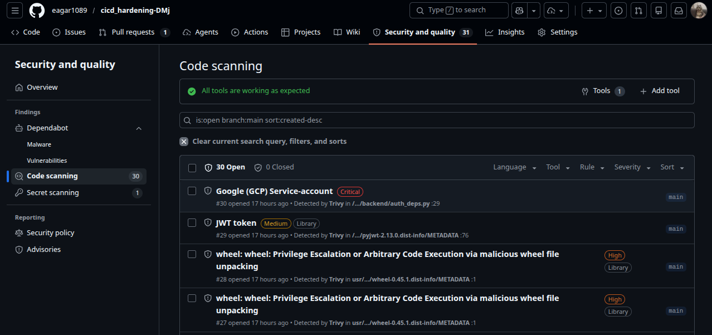
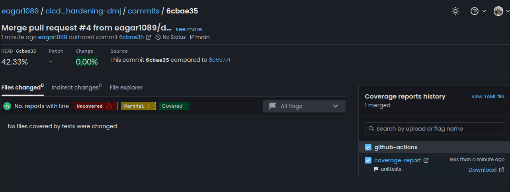

# CI/CD Hardening — Digital Memory Jar

[](https://github.com/eagar1089/cicd_hardening-DMj/actions/workflows/ci.yml)
[](https://github.com/eagar1089/cicd_hardening-DMj/actions/workflows/ci.yml)
<!-- [](https://codecov.io/gh/eagar1089/cicd_hardening-DMj) -->

A production-grade CI/CD + DevSecOps pipeline built on top of the [Digital Memory Jar](https://github.com/eagar1089/Digital-MemoryJar) FastAPI backend. This project demonstrates real-world security-first pipeline design using GitHub Actions — automated from lint to container scan, with full branch protection and artifact reporting.

---

## Pipeline overview

```text
Lint (Ruff)
    │
    ├──► Test (pytest + coverage)
    ├──► SAST (Bandit)
    └──► Dependency Scan (pip-audit)
              │
              ▼
     Docker Build + Trivy Scan
              │
              ▼
       GitHub Security Tab (SARIF)
```

---

## Security features

| Feature | Tool | What it catches |
|---|---|---|
| Static analysis (SAST) | Bandit | Hardcoded secrets, insecure functions, SQL injection patterns |
| Dependency audit | pip-audit | Known CVEs in `requirements.txt` packages |
| Container scan | Trivy | OS + library CVEs in the Docker image |
| Security dashboard | SARIF upload | Results visible in GitHub → Security → Code scanning |
| Branch protection | GitHub Settings | Blocks merge if any check fails |

---

## CI/CD features

- Automated testing with pytest
- Linting and style enforcement with Ruff
- Docker image build (no push — scan only) tagged by git SHA
- Multi-job pipeline with dependency ordering 
- Artifact upload for all security reports (from Actions tab)
- Least-privilege permissions — `contents: read` by default, elevated only where required

---

## Pipeline screenshots

<details>
<summary>CI pipeline run — all jobs green</summary>

</details>

<details>
<summary>Security scan results — Bandit + pip-audit reports</summary>




</details>

<details>
<summary>Trivy container scan output</summary>



</details>

<details>
<summary>GitHub Security tab — SARIF upload</summary>


</details>

<details>
<summary>Codecov coverage report</summary>



</details>

---

## Tech stack

- Python 3.11
- FastAPI
- Docker
- GitHub Actions
- Trivy — container CVE scanning
- Bandit — Python SAST
- pip-audit — dependency auditing
- Ruff — linting and formatting
- Codecov — coverage reporting

---

## Project structure

```
.github/
└── workflows/
    ├── ci.yml          ← main pipeline (lint → test → scan → docker)
    ├── security.yml    ← scheduled security scans (coming soon)
    └── release.yml     ← semantic versioning (coming soon)
backend/
├── main.py
├── nlp_processor.py
├── requirements.txt
└── tests/
docs/
└── screenshots/        ← add your pipeline screenshots here
    ├── ci-pipeline-green.png
    ├── bandit-report.png
    ├── pip-audit-report.png
    ├── trivy-scan-table.png
    ├── github-security-tab.png
    └── codecov-report.png
```

---
## Branch protection rules
Configured under Settings → Branches → `main`:
- Require all CI status checks to pass before merging
- Require pull request review before merging
- Block direct pushes to `main`
- Require branches to be up to date before merging

---

---

## Versioning strategy
Semantic versioning via GitHub Actions (release.yml):
```
patch fix   →  v0.0.1 → v0.0.2
feature     →  v0.0.2 → v0.1.0
breaking    →  v0.1.0 → v1.0.0
```
Tags are generated automatically based on conventional commit messages.
---
## Running locally

```bash
docker build -t memoryjar-backend ./backend
docker run -p 8000:8000 memoryjar-backend

# Run tests
cd backend
pytest --cov=backend -v

# Run linting
ruff check backend/

# Run security scan
bandit -r backend/ -x backend/tests --severity-level medium
```

---
## Secrets required

`MONGO_URI` = MongoDB Atlas URI |
`HF_TOKEN` = HuggingFace API token |
---

Built by [@eagar1089](https://github.com/eagar1089) · [Digital Memory Jar](https://github.com/eagar1089/Digital-MemoryJar)